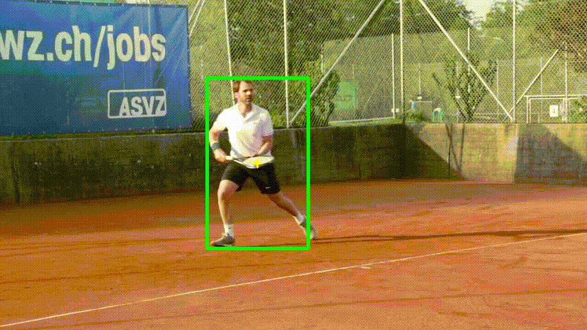

# Siamese-Neural-Networks-in-C++

This project is a **C++ implementation** of the **Siamese Transformer Pyramid Network (SiamTPN)** for single‑object tracking, converted from a Python baseline and designed to run with **ONNX Runtime**.  
Tested on **Linux Mint** (CPU-oriented).

> **Important:** Place both ONNX model files — `backbone_fpn_z.onnx` and `backbone_fpn_head_x.onnx` — in the **project root folder** (same folder where you run the app or pass relative paths from).

---

## Background
SiamTPN combines **lightweight CNN backbones** (e.g., ShuffleNetV2) with a **Transformer Pyramid Network (TPN)** that fuses multi‑scale features efficiently. A **Pooling Attention** design keeps attention costs low, enabling **real‑time CPU** tracking (≈30+ FPS reported in the paper), while maintaining competitive accuracy on benchmarks like LaSOT and UAV123.

---

## Dependencies (Linux Mint)
Install build tools and OpenCV:
```bash
sudo apt update
sudo apt install -y build-essential cmake pkg-config libopencv-dev
```

Download ONNX Runtime (prebuilt binaries), set `ORT_HOME`:
```bash
wget https://github.com/microsoft/onnxruntime/releases/download/v1.19.0/onnxruntime-linux-x64-1.19.0.tgz
tar -xzf onnxruntime-linux-x64-1.19.0.tgz -C $HOME/dev
export ORT_HOME="$HOME/dev/onnxruntime-linux-x64-1.19.0"
```
> You can put the `export ORT_HOME=...` line into your shell profile to persist it across sessions.

---

## Build (CMake)
From the project root (where `tracking.cpp` and the models live):
```bash
mkdir build
cd build
cmake .. -DORT_HOME="$ORT_HOME"
make -j"$(nproc)"
```
This produces an executable named `tracker` in `build/`.

If CMake can’t find OpenCV: make sure `libopencv-dev` is installed and `pkg-config --modversion opencv4` works.

---

## Run
Example command (relative paths assume models/video are in the project root or one level up as shown):
```bash
./tracker --video ../test.mp4 --z ../backbone_fpn_z.onnx --x ../backbone_fpn_head_x.onnx --show --save ../tracked_fixed.avi
```

### Arguments
- `--video` : Path to input video file  
- `--z` : Template ONNX model (kernel branch)  
- `--x` : Search/head ONNX model   
- `--show` : Show live window  
- `--save` : Save annotated video to the given path

On the first frame you’ll be asked to **select an ROI**; press **ENTER/SPACE** to confirm, **ESC** to cancel.

---

### Visual Demos (GIF)

**Input (test.gif)**  


**Tracked (tracking.gif)**  


> On the first frame the tracker prompts the user to select a Region of Interest (ROI). In this demo, the human in the video was chosen as the ROI, and the tracker then follows that person across frames.

---

## Notes
- The code runs on **CPU** by default. If your ONNX Runtime build supports CUDA, you can enable the CUDA EP by adding the corresponding line in the code where session options are created.  
- FPS is printed overlayed on the output frames.  
- Make sure both ONNX files are present in the **root folder** (or adjust the `--z` / `--x` paths accordingly).  

---

# Benchmarking (OTB-2015 Precision)

Use the same executable to run **dataset benchmarking** on OTB-2015. Place the dataset like:

```
OTB/
 ├─ Basketball/
 │   ├─ img/                  # 0001.jpg, 0002.jpg ... (zero‑padded) or .png
 │   └─ groundtruth_rect.txt  # x,y,w,h per line (commas or spaces)
 ├─ Bird1/
 │   ├─ img/
 │   └─ groundtruth_rect.txt
 └─ ...
```

### Run the benchmark
```bash
./tracker \
  --otb-root ./OTB \
  --z ./backbone_fpn_z.onnx \
  --x ./backbone_fpn_head_x.onnx \
  --thr 20
```

- `--otb-root` enables benchmark mode (scans subfolders with `img/` & `groundtruth_rect.txt`).
- `--thr` sets the primary precision threshold in pixels (default: 20).  
- The program prints per‑sequence **Precision@5/10/20/30/50px**, then dataset averages.

### Interpreting results
- The classic OTB metric is **Precision@20px**. In our case, reported averages:
  - **@5px:** 42.75%  
  - **@10px:** 67.49%  
  - **@20px:** **85.00%**  
  - **@30px:** 91.11%  
  - **@50px:** 95.54%  

 

---

